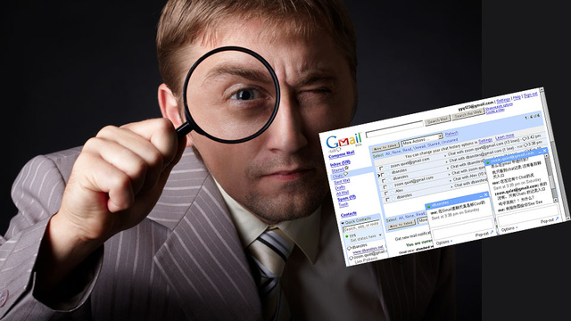

# Snowden's revelations 

In June 2013, Snowden reveals to the whole world shocking news about the U.S. government : the NSA is spying on the web traffic of the entire world ! This makes the headline of every newspaper in the world, everybody is talking about it. Everyone wonders how they should behave on the Internet, now that they know every one of their searches is being collected. 

Today, our task is to investigate how people behaved after the events. We will need to figure out whether people were chilled from using the Internet the way they used to, or not. For that, we have at our disposal data from Wikipedia view counts and Google searches counts.

Let's dive into these datasets and find out **how** people actually behaved.

# Let's start our investigation...

With more than 18 billions of monthly pageviews, there are a lot of Wikipedia articles at our disposal. We need to focus on the ones that are actually meaningful in our investigation. So we have to ask ourselves a question : what articles might people be chilled to look up after such revelations ? Imagine yourself, in June 2013, thinking about all your past activities on the Internet, trying to remember what you looked up that could potentially raise a flag for the government. Imagine yourself, in June 2013, wondering how you will look up, for tomorrow's speech in your history class, informations that the government might classify as suspucious.  

Well, it is interesting to think about what articles fall into that category. The category of topics that, when you look them up,  a small part of you thinks that this would make you look bad from the eyes of the government. This category contains every topic related to terrorism matters, because that's what the government is tracking, people with interest in terrorism's questions.

  

We are going to look at the view counts for articles on Wikipedia, related to terrorism, to find some insight about how people behaved. Here are the trends observed for before and after the revelations.





Interesting ! The number of views seems to have been impacted by the revelations !

# Snowden's revelations, not the only big news

While we are happy with our first results, let's not stop here. There are so many world's events that happen everyday, we cannot be sure that the chilling effect observed was due to the revelations of Snowden of 2013. Maybe a lot of events related to terrorism happened before 2013, so that's why we observe such trends. Of course that the Wikipedia views will be affected by external world's event. But what exactly were the external events related to terrorism before and after June 2013 ? We gathered most of them below. How do we do that ? Well, when there is a breaking news and you want to know more about it, what do you do ? You type keywords in Google. And probably so does everyone else. This creates an extraordinary amount of requests in the Google search bar, and we can find these counts numbers with the Google Trends tool. 

We gathered those extraordinary events, feel free to explore them.



# Ghouta chemical attack

Let's zoom into a particular example. On the calendar, we see that on the week of the 21 of March 2013, the Wikipedia article 'Chemical Weapon' has a high activity. It makes sense because on this date, there was an attack in Ghouta in Syria, during the civil war. It was the deadliest use of chemical weapon since the Iran-Iraq war. This event is about news in the world, and should be excluded from our study, because it is external to Snowden's revelations and causes an abnormal activity for the Wikipedia page. People wouldn't be chilled about getting informed on chemical weapons when this topic is at the center of every news. 



# Two cocktails from Ireland please !

On another note, we can look at the data for the 'Car Bomb' topic. We strangly observe a spike that seems to be there every year at the same date. Strange... But actually, for St Patrick, there is a popular irish 'Car Bomb' cocktail ! Guinness, Whiskey and Baileys's and you are good to go !



# Everybody calm down !

Now, let's focus again on our primary goal. We want to remove all the external world events from our study, because they are single events in time. We want an illustration of an effect that is lasting in time, not disturbed by external breaking news. This is an example of removing the outliers from the 'Chemical Weapon' topic we talked about earlier.



# Now are we still chilling ?
 Recall the question we need to answer : from June 2013, is there a constant fear of the goverment spying among Internet users ? Let's see what the data in a world without big common events looks like. To do that we reproduce the same figure as the first one, but without all the external events that disrupt the general trend. Do we still have chilling effect ? The suspense is at its peak...



# Chilling through the times

Even without outliers from breaking news, the number of views after the revelations still decreases ! People are afraid to look for sensible subjects, by fear of the online surveillance ! This is quite interesting because it means that the revelations had an impact on the behaviour of Internet users. It means that people are not totally free to browse the Internet, get informed on some subject, because they know that there exists online surveillance. Be careful on what you do on the Internet, the government is watching you.

    

